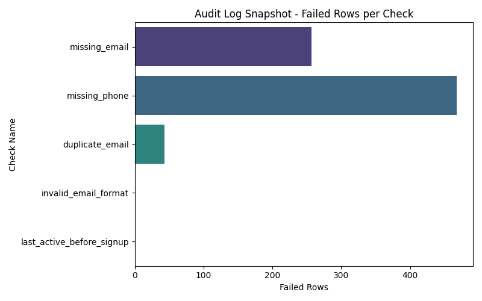
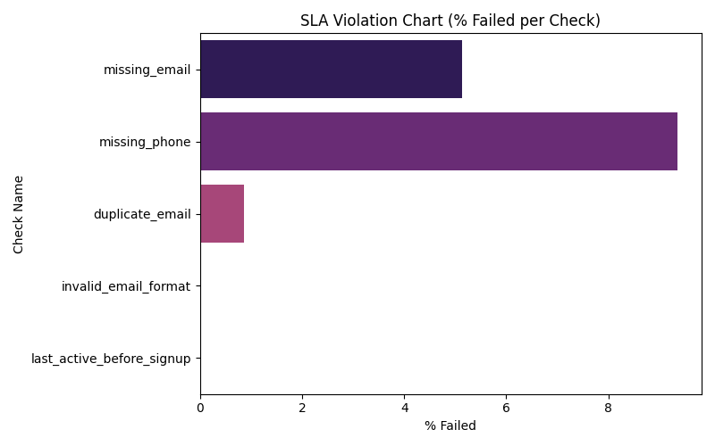
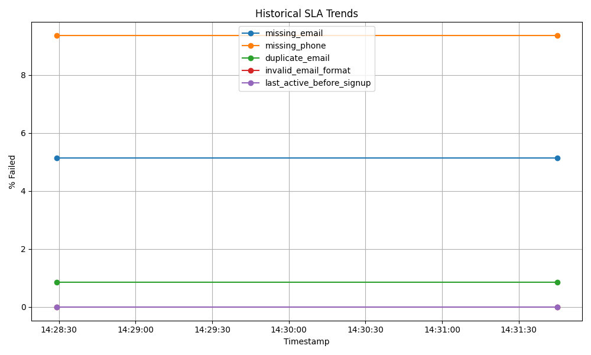

# Workforce Data Quality & Governance Analysis  
**UK Government Workforce Dataset**

## Overview

This project demonstrates an **end-to-end data quality and governance workflow** using a real UK government workforce dataset.

The goal is not to build models or flashy dashboards, but to show how a data analyst or data engineer:
- defines data expectations,
- detects quality violations using SQL,
- logs issues over time,
- evaluates them against SLAs,
- and translates findings into governance actions.

All Python and SQL code in this repository is **public, reviewable, and reproducible**.

---

## Dataset

**Source:** UK Government workforce transparency data  
**Type:** Real public-sector dataset  
**Rows:** ~3,000  
**Characteristics:** Missing fields, inconsistent pay ranges, implausible values

Key columns include:
- Parent Department
- Organisation
- Grade
- Generic Job Title
- Payscale Minimum (£)
- Payscale Maximum (£)
- Number of Posts (FTE)
- Office Region

---

## Repository Structure (All Code Public)

```text
customer-data-quality/
│
├── contracts/
│   └── workforce_data_contract.md
│
├── sql/
│   ├── dq_workforce_checks.sql
│   └── dq_sla_rules.sql
│
├── src/
│   ├── run_workforce_dq.py
│   └── generate_portfolio_outputs.py
│
├── data/
│   ├── raw/
│   └── processed/
│       ├── workforce.db
│       ├── dq_audit_log.csv
│       └── dq_sla_evaluation.csv
│
├── outputs/
│   ├── audit_log_snapshot.png
│   ├── sla_bar_chart.png
│   ├── historical_trend.png
│   └── dashboard_portfolio.html
│
└── README.md

```
---

## Data Governance Foundation

Before running any checks, a formal data contract defines expectations for the dataset.

File: contracts/workforce_data_contract.md

The contract specifies:

- Mandatory fields

- Valid numeric ranges

- Semantic rules (for example, senior roles should not map to implausibly low pay bands)

- Governance assumptions and ownership

---

## End-to-End Walkthrough

Problem

Government workforce data is used for:

- headcount reporting,

- cost analysis,

- policy decisions,

- audit transparency.

If grades, FTE counts, or pay bands are incorrect, reporting becomes misleading and potentially non-compliant.

---

## Investigation

Data quality checks are implemented in SQL:

 sql/dq_workforce_checks.sql

Checks include:

- Missing organisational hierarchy fields

- Missing grades or job titles

- Negative or unrealistic FTE values

- Payscale minimum greater than maximum

- Senior roles associated with implausibly low pay bands

Each check logs:

- check name

- number of failing rows

- execution timestamp

Results are appended to an audit log rather than overwritten.

---

## Findings 

| Issue                              | Failed Rows | Why It Matters                              |
|-----------------------------------|-------------|---------------------------------------------|
| Senior roles with low pay bands   | 14          | Distorts workforce cost reporting           |
| Negative FTE values               | 3           | Breaks headcount calculations               |
| Payscale min > max                | 2           | Invalid compensation data                   |
| Missing grades / job titles       | 0           | Controlled after validation                 |
| Missing organisational fields     | 0           | Controlled after validation                 |


These issues persist across multiple executions, indicating structural rather than one-off problems.

---

## SLA Evaluation

Each rule is evaluated against defined thresholds in:

 sql/dq_sla_rules.sql

Output:

 data/processed/dq_sla_evaluation.csv

This converts raw errors into governance-level signals (PASS / FAIL by severity).

---

## Resolution (What Would Happen Next)

If this were a real organisation, the next steps would include:

- Blocking ingestion of records with negative or implausible FTE values

- Enforcing pay band validation for senior grades at source systems

- Assigning departmental data owners for remediation

- Requiring documented sign-off for overrides

- Monitoring SLA breaches over time rather than fixing one-off errors

---

##  Outputs & Evidence

### Audit Log Snapshot


### SLA Violation Chart


### Historical Trend


### Dashboard


---

## How to Run

 pip install pandas matplotlib seaborn
 
 python src/run_workforce_dq.py
 
 python src/generate_portfolio_outputs.py

---

## Skills Demonstrated

- SQL data quality checks with business logic

- Data governance and data contracts

- Audit logging and SLA enforcement

- Analytical interpretation of real public-sector data

- Python-based reporting and visualisation

- BI-ready outputs for downstream tools

---

## Limitations

- SQLite used for simplicity

- Single dataset

- No CI/CD

- No automated remediation workflows


