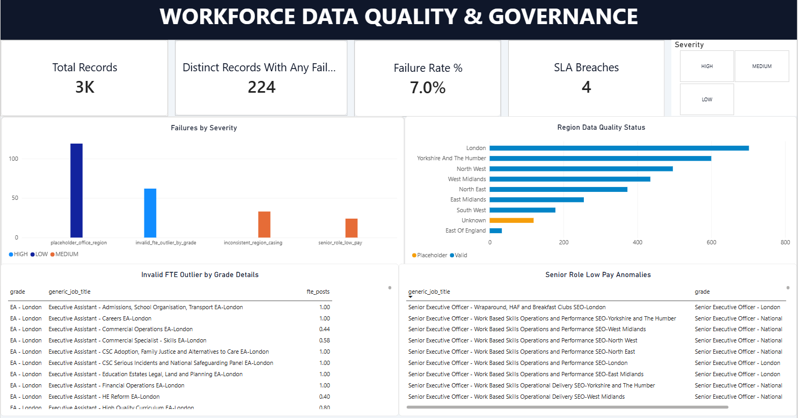
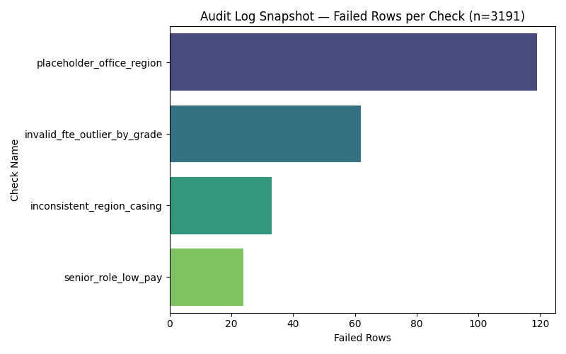
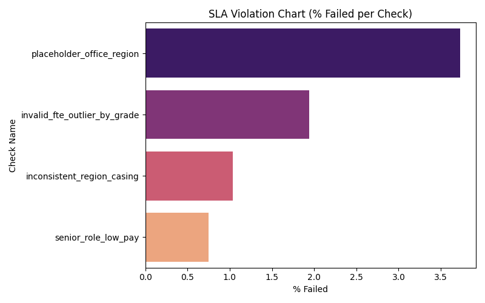
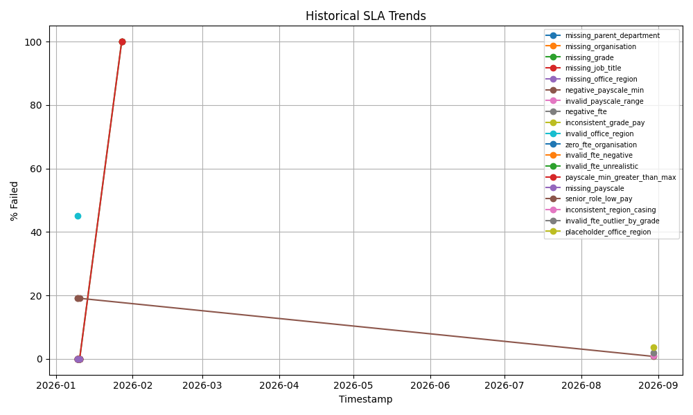

# Workforce Data Quality & Governance Analysis

A SQL-first data quality and governance pipeline for a UK government workforce dataset (~3,191 records). Checks are written and executed in SQL, Python only orchestrates the run and writes results to an audit log, so the validation logic lives where it belongs and can be reasoned about independently of the pipeline code around it.

## Overview

This repository demonstrates a **SQL-first, end-to-end data quality and governance workflow** using a real UK government workforce dataset.

The objective is not predictive modelling or dashboard aesthetics. The focus is on how an analyst or analytics engineer:

- defines enforceable data expectations,
- detects violations using SQL,
- logs failures over time,
- evaluates them against SLAs,
- and translates findings into concrete governance actions.

All SQL and Python code is **public, versioned, and reproducible**.

---

## Power BI Dashboard

Interactive report: **[powerbi/Workforce_Data_Quality___Governance.pbix](powerbi/Workforce_Data_Quality___Governance.pbix)**



Built directly on the corrected pipeline output (`workforce_clean.csv`, `dq_failures.csv`, `dq_sla_evaluation.csv`). Includes:
- 4 KPI cards (Total Records, Distinct Records With Any Failure, Failure Rate %, SLA Breaches)
- Severity breakdown chart, sorted by failed row count
- Region data quality visual (surfaces the casing and placeholder-value findings directly)
- Drill-through detail tables for the two highest-confidence findings: FTE grade-relative outliers and senior role low pay

GitHub can't render `.pbix` files inline, the link above downloads it. Open in Power BI Desktop (free) to interact with it directly.

---

## SQL-First Architecture (Deliberate Design Choice)

All data quality logic is implemented in **SQL**, not Python.

Python is used strictly to:
- validate the runtime schema matches what the SQL expects, before running anything,
- orchestrate execution,
- load SLA thresholds,
- persist audit results,
- export BI-ready outputs.

This mirrors real enterprise environments where:
- data quality rules live close to the data,
- SQL logic is auditable and reviewable by governance teams,
- Python acts as a control layer, not a logic layer.

---

## SQL Techniques Demonstrated

- Window functions for grade-relative statistical outlier detection (partition-by-grade z-scores, not fixed thresholds)
- Conditional aggregation for failure metrics
- Cross-field validation (payscale minimum vs maximum)
- Case-insensitive grouping to surface categorical inconsistencies (region name casing)
- Semantic business rules (grade-to-pay alignment)
- Severity classification aligned to governance escalation
- Time-stamped audit logging for trend analysis, with SLA evaluation pinned to the most recent run only

---

## Where to Review SQL Work

All data quality and governance logic lives in the `sql/` directory:

- `sql/dq_workforce_checks.sql`
  Production-style data quality rules with persistent audit logging

- `sql/dq_sla_rules.sql`
  SLA thresholds and severity mapping

- `sql/exploratory_analysis.sql`
  Root-cause and impact analysis queries used to understand failure patterns

Python does **not** embed business logic.

---

## Dataset

**Source:** UK Government workforce transparency data (public)
**Rows:** 3,191
**Domain:** Public-sector workforce reporting

Key fields:
- Parent Department, Organisation, Grade, Generic Job Title
- Payscale Minimum (£), Payscale Maximum (£)
- FTE Posts (row-level aggregate post count, not a single employee's FTE fraction, see the FTE section below)
- Office Region

---

## Repository Structure

```text
Workforce-Data-Quality-Governance-Analysis/
│
├── contracts/
│   └── workforce_data_contract.md
│
├── sql/
│   ├── dq_workforce_checks.sql
│   ├── dq_sla_rules.sql
│   └── exploratory_analysis.sql
│
├── src/
│   ├── run_workforce_dq.py
│   └── generate_portfolio_outputs.py
│
├── data/
│   ├── raw/
│   └── processed/
│       ├── workforce.db
│       ├── dq_audit_log.csv
│       └── dq_sla_evaluation.csv
│
├── outputs/
│   ├── audit_log_snapshot.png
│   ├── sla_bar_chart.png
│   ├── historical_trend.png
│   └── dashboard_portfolio.html
│
├── requirements.txt
└── README.md
```

---

## Data Governance Foundation

Before any validation is executed, a data contract defines the expected structure and semantics of the dataset.

File: `contracts/workforce_data_contract.md`

The contract specifies:
- Mandatory fields
- Acceptable numeric ranges
- Semantic rules linking grade seniority to pay bands
- Ownership and governance assumptions

This mirrors how modern data teams enforce quality upstream rather than react downstream.

---

## Investigation

Data quality rules are implemented in SQL and executed against a SQLite database.

File: `sql/dq_workforce_checks.sql`

Checks include:
- Missing organisational hierarchy fields
- Missing grades or job titles
- Negative or statistically outlying FTE post counts
- Payscale minimum greater than maximum
- Missing payscale values
- Senior roles mapped to implausibly low pay bands
- Region values that are logically the same but differ in casing
- Region values that are placeholder text ("Unknown") rather than genuine missing data

Each rule writes results to a persistent audit table containing `check_name`, `failed_rows`, and `check_timestamp`. Failures are logged historically rather than overwritten, enabling trend analysis. SLA evaluation is filtered to the most recent run only, older runs remain in the audit log for trend analysis but are excluded from the current SLA snapshot.

---

## Findings

All findings below are verified directly against `data/processed/workforce.db` by running the current version of `sql/dq_workforce_checks.sql`, with results cross-checked manually row by row before being reported here.

| Issue | Failed Rows | % of Dataset | SLA Status | Why It Matters |
|---|---|---|---|---|
| Placeholder region values ("Unknown") | 119 | 3.7% | FAIL | Invisible to standard NULL/blank checks, understates true regional coverage in any headcount-by-region reporting |
| FTE post counts statistically outlying within their grade | 62 | 1.9% | FAIL | Grade-relative z-score outliers worth investigating individually, not evidence of systemic breakage |
| Senior roles with low pay bands | 24 | 0.75% | FAIL | Directors/Heads/Chiefs with a payscale maximum under £40k, either a data entry issue or a genuine compensation anomaly worth escalating |
| Inconsistent region casing | 33 | 1.0% | FAIL | "East Of England" vs "East of England" silently fragments any region-based rollup, filter, or slicer |
| Missing grades / job titles / organisational fields | 0 | 0% | PASS | Controlled through validation rules |
| Payscale minimum greater than maximum | 0 | 0% | PASS | Compensation data is structurally sound |
| Missing payscale values | 0 | 0% | PASS | Compensation data is complete |
| Negative FTE post counts | 0 | 0% | PASS | No negative values present |

Two of these numbers were **not** what this project originally reported. See "Debugging Note" below for what actually happened and why it matters more than the findings themselves.

---

## Debugging Note: What the Original Version Got Wrong

An earlier version of this README reported that ~100% of rows failed both the FTE validity check and the payscale min-greater-than-max check. Both numbers were wrong, and the root cause is more interesting than the fake findings were.

**Root cause:** the SQL checks referenced column names like `"Payscale Minimum (£)"` and `"Number of Posts in FTE"`, written against an earlier version of the schema. The actual database uses lowercase snake_case columns (`payscale_minimum`, `fte_posts`, etc.). SQLite does not error when a double-quoted identifier fails to match a real column, it silently falls back to treating the identifier as a string literal. So a check like:

```sql
WHERE "Payscale Minimum (£)" > "Payscale Maximum (£)"
```

silently became a constant string comparison, `'Payscale Minimum (£)' > 'Payscale Maximum (£)'`, evaluated once and applied identically to every row, which is why it flagged the entire dataset. The actual payscale data has zero integrity issues.

Separately, the FTE check used a fixed threshold (`fte > 1.5`, later `> 5`) that assumed one row equals one employee. It doesn't: `fte_posts` is a row-level aggregate (grouped by Department/Organisation/Grade/Job Title), ranging from 0.4 to 57.96 with a mean of 2.37. A fixed per-person cap was the wrong shape of rule for this grain, not a real finding.

Both issues were caught by loading the actual database, running each check's WHERE clause standalone, and manually inspecting the rows it returned before trusting the aggregate count, rather than trusting a percentage without reading the rows behind it. The fixed checks were then verified against the real data before this README was rewritten. I'm documenting this here instead of quietly fixing it, because catching your own tooling silently lying to you is a more relevant skill for this kind of work than any of the individual SQL checks are.

---

## Deep Dive: FTE Post Count Outliers

### Why a fixed threshold was wrong

`fte_posts` is an aggregate count of posts per row grouping, not a per-employee fraction. A senior grade with few staff and a junior grade with a large team will have very different normal ranges. A single fixed cutoff either misses real anomalies in low-count grades or falsely flags normal high-count grades.

### Detection logic

Outliers are now flagged relative to their own grade, using a z-score over a window:

```sql
SELECT
    rowid,
    fte_posts,
    grade_avg,
    ABS(fte_posts - grade_avg) / grade_stdev AS z_score
FROM (
    SELECT
        rowid, fte_posts, grade,
        AVG(fte_posts) OVER (PARTITION BY grade) AS grade_avg
    FROM workforce
)
-- grade_stdev computed per grade, see sql/dq_workforce_checks.sql for the full query
WHERE ABS(fte_posts - grade_avg) / grade_stdev > 3;
```

### Interpretation

62 rows (1.9%) sit more than 3 standard deviations from their grade's average post count. That's a plausible, investigable number for a real dataset, not a sign of systemic breakage. Each flagged row is worth a manual look rather than automatic rejection, since a legitimately large team in one department could be a real outlier without being an error.

### Impact if unaddressed

If consumed by downstream BI tools without review, these rows could distort per-grade cost-per-post averages and skew capacity planning for the specific grades involved, a narrow, contained risk rather than a dataset-wide one.

---

## Impact Assessment

| Issue | Failed Rows | Impact Category | Governance Risk |
|---|---|---|---|
| Placeholder region values | 119 | Regional reporting | Understates true region coverage; any "by region" report is silently incomplete for ~4% of records |
| Inconsistent region casing | 33 | Regional reporting | Fragments regional rollups into duplicate categories |
| FTE outliers by grade | 62 | Headcount & planning | Localized risk to specific grade-level cost and capacity metrics |
| Senior role low pay | 24 | Financial reporting / compliance | Possible compensation data entry error or genuine governance issue worth escalating |

---

### Priority Classification

- **High**: Placeholder and inconsistent region values. Small in volume but structurally invisible to naive completeness checks, and directly corrupts any regional aggregation.
- **Medium**: FTE grade-relative outliers, senior role low pay. Worth individual review, not evidence of systemic failure.
- **Controlled**: Missing grades, job titles, organisational fields, payscale integrity. Currently clean and did not breach SLA.

---

## Recommended Remediation Actions

### 1. Source-Level Controls
- Standardize region name casing at ingestion (case-insensitive dedup before load)
- Require an explicit reason code when "Unknown" region is submitted, rather than accepting it as a free-text default

### 2. Governance Controls
- Require department-level review for FTE post counts flagged as grade-relative outliers
- Require sign-off for senior roles with payscale maximum under a defined floor

### 3. Monitoring & Escalation
- Add a schema-validation guard before every pipeline run (implemented in `run_workforce_dq.py`), so a future column rename fails loudly instead of silently corrupting every downstream check
- Treat repeated SLA breaches as governance incidents, not one-off fixes
- Track trends over time instead of point-in-time corrections

---

## Ownership Model

| Issue Type | Primary Owner | Secondary Owner |
|---|---|---|
| Region data quality | Department Admin | Central Data Team |
| FTE post count anomalies | Workforce Analytics | HR Systems |
| Senior role pay bands | Finance | Data Governance |
| Pipeline schema integrity | Data Engineering | Central Data Team |

This project treats data quality failures as governance decisions, not technical inconveniences, and treats pipeline bugs the same way.

---

## SLA Evaluation

Each data quality rule is evaluated against predefined thresholds and severities.

File: `sql/dq_sla_rules.sql`
Output: `data/processed/dq_sla_evaluation.csv`

The SLA export is filtered to the most recent pipeline run (`WHERE check_timestamp = MAX(check_timestamp)`), an earlier version of this join pulled in every historical run without filtering, which would have silently duplicated rows in the export after more than one execution.

This converts raw failures into governance signals: PASS or FAIL by severity, enabling prioritisation rather than alert fatigue.

---

## Outputs & Evidence

Screenshots and the dashboard below need to be regenerated from the corrected pipeline before they're an accurate reflection of the current findings, they still reflect the earlier, incorrect data.

### Audit Log Snapshot


### SLA Violation Chart


### Historical Trend Analysis


### Interactive Dashboard
[Dashboard](https://ashwinbasil.github.io/Workforce-Data-Quality-Governance-Analysis/)

### Power BI Report
[Download the full .pbix](powerbi/Workforce_Data_Quality___Governance.pbix) — see the "Power BI Dashboard" section near the top of this README for a screenshot and feature breakdown.

---

## How to Run

```bash
pip install -r requirements.txt
python src/run_workforce_dq.py
python src/generate_portfolio_outputs.py
```

---

## Skills Demonstrated

- SQL-based data quality validation with business logic
- Root-cause debugging of silent tooling failures (SQLite identifier fallback, schema drift), not just writing checks but verifying they're checking what you think they're checking
- Data contracts and governance design
- Audit logging and SLA enforcement, with correct latest-run scoping
- Statistical outlier detection (grade-relative z-scores) instead of fixed, ungrounded thresholds
- Analytical interpretation of public-sector data
- Python-based reporting and visualisation
- BI-ready, stakeholder-facing outputs

---

## Limitations

- SQLite used for simplicity, its lenient identifier handling was itself a source of a real bug in this project, documented above
- Single dataset
- No CI/CD
- No automated remediation workflows
- Power BI dashboard and static outputs need to be regenerated against the corrected pipeline before being treated as current